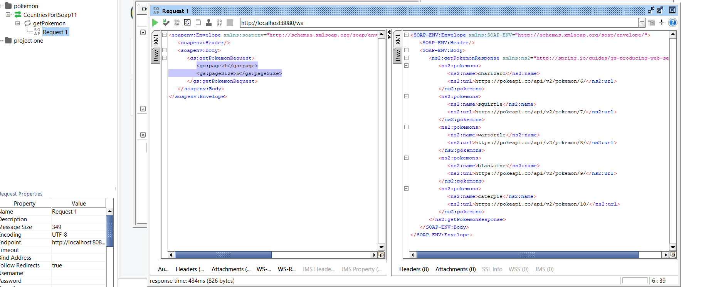

Proyecto de Spring-boot para consumir la api restful: API RESTful https://pokeapi.co/api/v2/pokemon
y exponer los resultados paginados con una api soap

Instrucciones de instalación:
1. Instalar java version 17
2. Compilar el proyecto mediante maven: > .\mvnw clean package .
3. Correr el ejecutable del proyecto: > java -jar target/producing-web-service-initial-0.0.1-snapshot.jar
4. Instalar el software SoapUI

Instructiones de uso:

1. Importar el proyecto ubicado en la carpeta soapUI o crear un nuevo proyecto soap con initial WSDL: http://localhost:8080/ws/countries.wsdl
2. Para consultar la página y el tamaño de la página completar los campos <gs:page>número de la página</gs:page>
   <gs:pageSize>tamaño de la página</gs:pageSize> como se muestra en la imagen, de momento se están consultando máximo 20 pokemons
3. La lista debería aparecer.

JUSTIFICACIÓN DE LOS PATRONES DE DISEÑO:

Patrón singleton: Se está usando la anotación @Service en la interface PokemonService, esto le indica a la librería Spring que solo puede haber una instancia de este servicio haciendo uso de este patrón de diseño.

Patron Factory: Se está haciendo uso de este patrón para crear objetos de tipo Pokemon en el método createPokemon de la clase PokemonFactory, encapsulando esta funcionalidad y haciendola mas facil de modificar.
